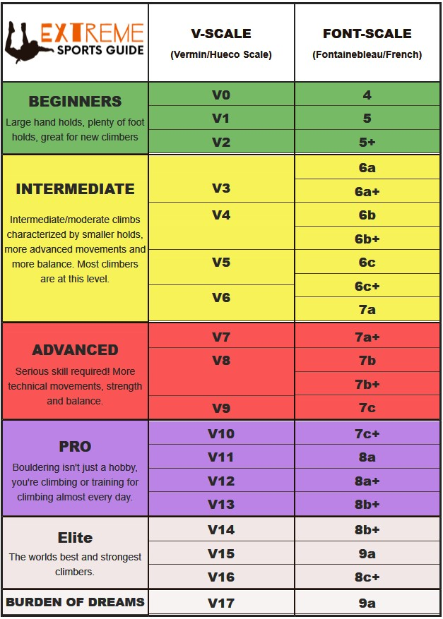

# AlexaClimbingGradeConverter
• Developed an Alexa Skill to efficiently convert American and European climbing grades and give flash briefings on climbing news.
• Utilized AWS Lambda, a pay-as-you-go service, to remotely host serverless code which reduced costs by 50% compared to EC2.
• Obtained climbing-related news from News API, supporting briefings on headlines, sources, or entire articles.
• Remotely hosted serverless code allowed access to this Alexa skill 24/7 from any Alexa device anywhere.

An AWS Lambda (Server-less) program I wrote to convert climbing grades at ease between the V-Grade system and the Font Grade system.

In bouldering (rock climbing without ropes), there are two popular systems for grading the difficulty of climbs. There's the V-Grade system which is commonly used in the USA and the Font system which is most commonly used in Europe. I watch a lot of climbing videos during my free-time and majority of the videos take place in Europe which uses the Font system. Although, I don't memorize the grade conversion so I always had to stop what I was doing to look up the conversion. One day I tried asking Alexa for the conversion and it had no clue what I was talking about so I decided to make an Alexa skill to do so.

Figuring out how to use AWS' Lambda technology was pretty fun. I got to learn how to host server-less code in the cloud, and see the effects of my program in real time. 

One problem I encountered was that sometimes in the online Alexa simulation where you would type in commands, you would get an error saying "There was an issue processing your input." How I worked around the error was constantly refreshing the page until the command worked. I tried to do some research into the bug, but I didn't have any firewalls like online forums suggested may have been the problem. At first I believed the cause of the issue to be having multiple testing tabs open at once, but closing the duplicates did not seem to change anything either.

Hopefully in the future when I work with AWS Lambda again I can find the root of this problem!

Here is a picture of the conversion chart I used:

